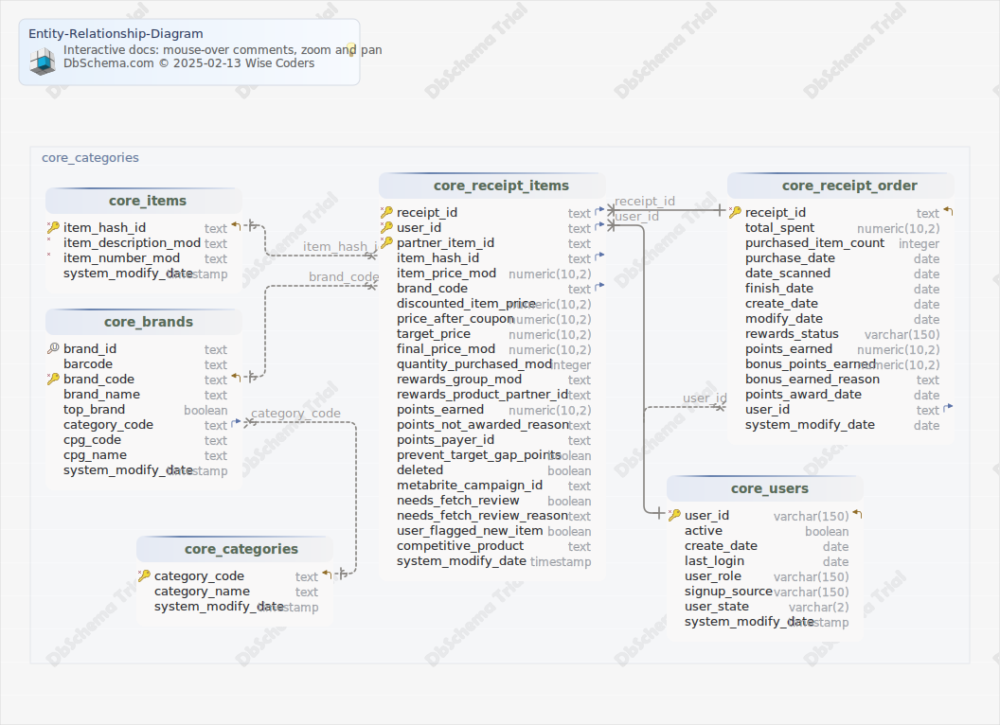

#Entity-Relationship-Diagram
Generated using [DbSchema](https://dbschema.com)

### Core_ERD

## Tables

1. [c_core.core_brands](#table%20c\_core.core\_brands) 
2. [c_core.core_categories](#table%20c\_core.core\_categories) 
3. [c_core.core_items](#table%20c\_core.core\_items) 
4. [c_core.core_receipt_items](#table%20c\_core.core\_receipt\_items) 
5. [c_core.core_receipt_order](#table%20c\_core.core\_receipt\_order) 
6. [c_core.core_users](#table%20c\_core.core\_users) 

### Table c_core.core_brands 
|Idx |Name |Data Type |
|---|---|---|
| &#128269; | brand\_id| text  |
|  | barcode| text  |
| * &#128273;  &#11019; | brand\_code| text  |
|  | brand\_name| text  |
|  | top\_brand| boolean  |
| &#11016; | category\_code| text  |
|  | cpg\_code| text  |
|  | cpg\_name| text  |
|  | system\_modify\_date| timestamp  DEFAULT CURRENT_TIMESTAMP |

##### Indexes 
|Type |Name |On |
|---|---|---|
| &#128273;  | core\_brands\_pkey | ON brand\_code|
| &#128269;  | core\_brands\_brand\_id\_key | ON brand\_id|

##### Foreign Keys
|Type |Name |On |
|---|---|---|
|  | core_brands_category_code_fkey | ( category\_code ) ref [c\_core.core\_categories](#core\_categories) (category\_code) |

### Table c_core.core_categories 
|Idx |Name |Data Type |
|---|---|---|
| * &#128273;  &#11019; | category\_code| text  |
|  | category\_name| text  |
|  | system\_modify\_date| timestamp  DEFAULT CURRENT_TIMESTAMP |

##### Indexes 
|Type |Name |On |
|---|---|---|
| &#128273;  | core\_categories\_pkey | ON category\_code|

### Table c_core.core_items 
|Idx |Name |Data Type |
|---|---|---|
| * &#128273;  &#11019; | item\_hash\_id| text  |
| * | item\_description\_mod| text  |
| * | item\_number\_mod| text  |
|  | system\_modify\_date| timestamp  DEFAULT CURRENT_TIMESTAMP |

##### Indexes 
|Type |Name |On |
|---|---|---|
| &#128273;  | core\_items\_pkey | ON item\_hash\_id|

### Table c_core.core_receipt_items 
|Idx |Name |Data Type |
|---|---|---|
| * &#128273;  &#11016; | receipt\_id| text  |
| * &#128273;  &#11016; | user\_id| text  |
| * &#128273;  | partner\_item\_id| text  |
| &#11016; | item\_hash\_id| text  |
|  | item\_price\_mod| numeric(10,2)  |
| &#11016; | brand\_code| text  |
|  | discounted\_item\_price| numeric(10,2)  |
|  | price\_after\_coupon| numeric(10,2)  |
|  | target\_price| numeric(10,2)  |
|  | final\_price\_mod| numeric(10,2)  |
|  | quantity\_purchased\_mod| integer  |
|  | rewards\_group\_mod| text  |
|  | rewards\_product\_partner\_id| text  |
|  | points\_earned| numeric(10,2)  |
|  | points\_not\_awarded\_reason| text  |
|  | points\_payer\_id| text  |
|  | prevent\_target\_gap\_points| boolean  |
|  | deleted| boolean  |
|  | metabrite\_campaign\_id| text  |
|  | needs\_fetch\_review| boolean  |
|  | needs\_fetch\_review\_reason| text  |
|  | user\_flagged\_new\_item| boolean  |
|  | competitive\_product| text  |
|  | system\_modify\_date| timestamp  DEFAULT CURRENT_TIMESTAMP |

##### Indexes 
|Type |Name |On |
|---|---|---|
| &#128273;  | core\_receipt\_items\_pkey | ON receipt\_id, user\_id, partner\_item\_id|

##### Foreign Keys
|Type |Name |On |
|---|---|---|
|  | core_receipt_items_brand_code_fkey | ( brand\_code ) ref [c\_core.core\_brands](#core\_brands) (brand\_code) |
|  | core_receipt_items_user_id_fkey | ( user\_id ) ref [c\_core.core\_users](#core\_users) (user\_id) |
|  | core_receipt_items_receipt_id_fkey | ( receipt\_id ) ref [c\_core.core\_receipt\_order](#core\_receipt\_order) (receipt\_id) |
|  | core_receipt_items_item_hash_id_fkey | ( item\_hash\_id ) ref [c\_core.core\_items](#core\_items) (item\_hash\_id) |

### Table c_core.core_receipt_order 
|Idx |Name |Data Type |
|---|---|---|
| * &#128273;  &#11019; | receipt\_id| text  |
|  | total\_spent| numeric(10,2)  |
|  | purchased\_item\_count| integer  |
|  | purchase\_date| date  |
|  | date\_scanned| date  |
|  | finish\_date| date  |
|  | create\_date| date  |
|  | modify\_date| date  |
|  | rewards\_status| varchar(150)  |
|  | points\_earned| numeric(10,2)  |
|  | bonus\_points\_earned| numeric(10,2)  |
|  | bonus\_earned\_reason| text  |
|  | points\_award\_date| date  |
| &#11016; | user\_id| text  |
|  | system\_modify\_date| date  DEFAULT CURRENT_TIMESTAMP |

##### Indexes 
|Type |Name |On |
|---|---|---|
| &#128273;  | core\_receipt\_order\_pkey | ON receipt\_id|

##### Foreign Keys
|Type |Name |On |
|---|---|---|
|  | core_receipt_order_user_id_fkey | ( user\_id ) ref [c\_core.core\_users](#core\_users) (user\_id) |

### Table c_core.core_users 
|Idx |Name |Data Type |
|---|---|---|
| * &#128273;  &#11019; | user\_id| varchar(150)  |
|  | active| boolean  |
|  | create\_date| date  |
|  | last\_login| date  |
|  | user\_role| varchar(150)  |
|  | signup\_source| varchar(150)  |
|  | user\_state| varchar(2)  |
|  | system\_modify\_date| timestamp  DEFAULT CURRENT_TIMESTAMP |

##### Indexes 
|Type |Name |On |
|---|---|---|
| &#128273;  | core\_users\_pkey | ON user\_id|

